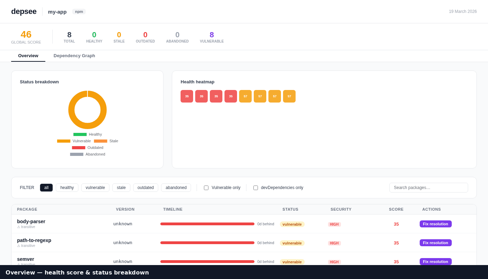

# depsee

**See your dependencies like never before.**

An interactive CLI dashboard for npm dependency health — health scores, dataviz, security audit, and one-click updates, all in your browser.

[](https://github.com/Nicolas-Deleplace/depsee/actions/workflows/ci.yml)
[](https://www.npmjs.com/package/depsee)
[](https://www.npmjs.com/package/depsee)
[](https://nodejs.org)
[](LICENSE)



---

## Features

- **Health score** (0–100) per package — weighted on age, staleness, missed versions, and publish frequency
- **Security audit** — integrates `npm audit`, `yarn audit`, `pnpm audit` and surfaces CVEs per package
- **Interactive UI** — real-time terminal overlay for update/remove/fix commands, streamed line by line
- **Fix resolution** — automatically adds `overrides` (npm/pnpm/bun) or `resolutions` (yarn) for transitive vulnerabilities
- **Dataviz** — donut chart by status, health heatmap, per-package timeline bars
- **All package managers** — npm, yarn, pnpm, bun (auto-detected from lockfile)
- **CI mode** — exit 1 when global score is below your threshold (`--ci --min-score 80`)
- **JSON output** — pipe-friendly, pure JSON on stdout when `--format json`

---

## Quick start

```bash
# Run without installing (recommended for one-off checks)
npx depsee

# Or install globally
npm install -g depsee
depsee
```

This analyses your project, writes `depsee-report.html`, and opens it in the browser.

### Interactive dashboard

```bash
depsee --serve
# → Opens http://localhost:4242
```

The dashboard lets you update, remove, or fix vulnerabilities with a single click and watch the output stream in real time directly in the UI.

---

## Screenshot

> _Run `depsee --serve` in any npm project to see the live dashboard._

<!-- Add a screenshot here: npx depsee --serve, open http://localhost:4242, screenshot → docs/screenshot.png -->

---

## Usage

```
depsee [options]
```

| Option | Default | Description |
|---|---|---|
| `--serve` | `false` | Launch the interactive UI at `localhost:<port>` |
| `--port <n>` | `4242` | Port for `--serve` mode |
| `--format <fmt>` | `html` | Output format: `html` or `json` |
| `--output <path>` | `depsee-report.html` | Output file path |
| `--only <type>` | _(all)_ | Filter: `deps` (skip devDeps) or `devDeps` (skip deps) |
| `--ignore <pkgs>` | — | Comma-separated list of packages to skip |
| `--no-audit` | `false` | Skip the security audit |
| `--ci` | `false` | Exit 1 if global score is below `--min-score` |
| `--min-score <n>` | `60` | Minimum score for CI gate |
| `--debug` | `false` | Print verbose debug output |
| `--help` | — | Show help |
| `--version` | — | Show version |

### Examples

```bash
# Interactive dashboard on port 3000
depsee --serve --port 3000

# CI gate — fail the build if score < 75
depsee --ci --min-score 75 --no-audit

# JSON output, skip dev deps, pipe to jq
depsee --format json --only=deps | jq '.summary'

# Skip known false-positives
depsee --ignore=lodash,moment

# Save an HTML report to a custom path
depsee --output reports/deps-$(date +%F).html
```

---

## Health score

Each package receives a score from **0 to 100**, computed from four weighted signals:

| Signal | Weight | Description |
|---|---|---|
| Age of installed version | 30% | How long ago the installed version was published |
| Staleness (gap to latest) | 30% | Days between installed and latest release |
| Missed versions | 20% | Number of releases skipped |
| Publish frequency | 20% | How actively the package is maintained |

A **severity cap** is applied on top of the weighted score:

| Severity | Score cap |
|---|---|
| Critical | 20 |
| High | 35 |
| Moderate | 60 |
| Low / Info | No cap |

The package status is derived from the final score:

| Status | Condition |
|---|---|
| `vulnerable` | Any vulnerability present |
| `abandoned` | Frequency < 0.5 releases/year **and** gap > 365 days |
| `healthy` | Score ≥ 75 |
| `stale` | Score ≥ 45 |
| `outdated` | Score < 45 |

---

## Package manager support

depsee auto-detects your package manager from the lockfile (in priority order: `bun.lockb` → `pnpm-lock.yaml` → `yarn.lock` → `package-lock.json`).

| PM | Detect | Update | Remove | Audit |
|---|---|---|---|---|
| npm | `package-lock.json` | `npm install <pkg>@latest` | `npm uninstall <pkg>` | `npm audit --json` |
| yarn | `yarn.lock` | `yarn add <pkg>` | `yarn remove <pkg>` | `yarn audit --json` |
| pnpm | `pnpm-lock.yaml` | `pnpm add <pkg>` | `pnpm remove <pkg>` | `pnpm audit --json` |
| bun | `bun.lockb` | `bun add <pkg>` | `bun remove <pkg>` | `npm audit --json` |

---

## Programmatic API

depsee can be used as a library in your own scripts:

```typescript
import { analyze } from 'depsee'

const report = await analyze({
  cwd: process.cwd(),       // project root
  includeDevDeps: true,     // include devDependencies
  audit: true,              // run security audit
  ignore: ['lodash'],       // skip these packages
  debug: false,             // verbose logging
})

console.log(report.summary)
// {
//   projectName: 'my-app',
//   total: 42,
//   healthy: 30,
//   stale: 5,
//   outdated: 4,
//   abandoned: 1,
//   vulnerable: 2,
//   score: 78,
//   packageManager: 'npm',
//   generatedAt: '2026-03-19T…'
// }

// Write an HTML report
await report.toHTML('./depsee-report.html')

// Write a JSON report
await report.toJSON('./depsee-report.json')
```

### Types

```typescript
interface DepInfo {
  name: string
  type: 'dependency' | 'devDependency' | 'transitive'
  wanted: string        // version range from package.json
  installed: string     // resolved installed version
  latest: string        // latest version on the registry
  installedAt: string   // ISO date of installed version
  latestAt: string      // ISO date of latest version
  gapDays: number       // days behind latest
  missedVersions: number
  publishFrequency: number
  score: number         // 0–100
  status: 'healthy' | 'stale' | 'outdated' | 'abandoned' | 'vulnerable'
  vulnerabilities: Vulnerability[]
}

interface Vulnerability {
  id: string
  title: string
  severity: 'critical' | 'high' | 'moderate' | 'low' | 'info'
  url: string
  fixAvailable: boolean
  fixedIn?: string
}
```

---

## CI integration

### GitHub Actions

```yaml
- name: Check dependency health
  run: npx depsee --ci --min-score 70 --no-audit
```

Or with the security audit included:

```yaml
- name: Check dependency health + security
  run: npx depsee --ci --min-score 70
```

> **Tip:** add `--only=deps` to skip devDependencies in production CI pipelines.

### Pre-commit hook (with [husky](https://github.com/typicode/husky))

```bash
npx husky add .husky/pre-commit "npx depsee --ci --min-score 60 --no-audit"
```

---

## Development

```bash
git clone https://github.com/Nicolas-Deleplace/depsee
cd depsee
npm install

# Build
npm run build

# Unit tests
npm test

# Integration tests
npm run test:e2e

# All tests
npm run test:all

# Type-check
npm run typecheck

# Watch mode
npm run test:watch
```

### Project structure

```
src/
├── cli.ts          CLI entry point — argument parsing, output formatting
├── server.ts       HTTP server for --serve mode (streaming NDJSON)
├── analyzer.ts     Core analysis pipeline
├── registry.ts     npm registry client (batch fetching with Zod validation)
├── auditor.ts      npm/yarn/pnpm audit parser
├── scorer.ts       Health score computation and status derivation
├── detector.ts     Package manager detection and command generation
├── renderer.ts     HTML report generator (interactive dashboard)
├── types.ts        Shared TypeScript types
└── __tests__/
    ├── scorer.test.ts    17 unit tests
    ├── detector.test.ts  24 unit tests
    ├── auditor.test.ts   22 unit tests
    ├── analyzer.test.ts  13 integration tests
    ├── e2e.test.ts        15 integration + CLI smoke tests
    └── fixtures/          npm/yarn/pnpm audit JSON fixtures
```

### Publishing a new release

```bash
# Bump the version
npm version patch   # or minor / major

# Push the tag — the release workflow takes care of the rest
git push --follow-tags
```

The [release workflow](.github/workflows/release.yml) will:
1. Run the full test suite
2. Publish to npm with provenance (`--provenance`)
3. Create a GitHub Release with auto-generated changelog

---

## Requirements

- Node.js ≥ 20
- One of: npm, yarn, pnpm, or bun

---

## License

MIT © Nicolas Deleplace
